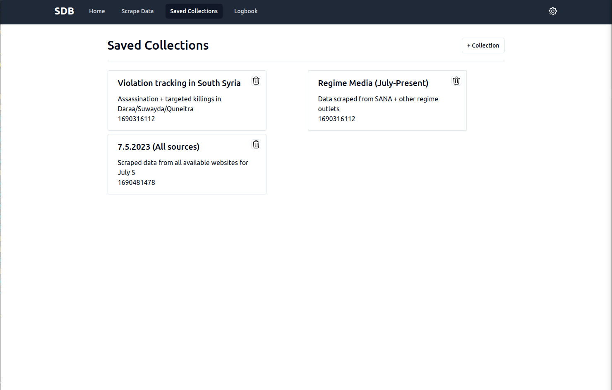
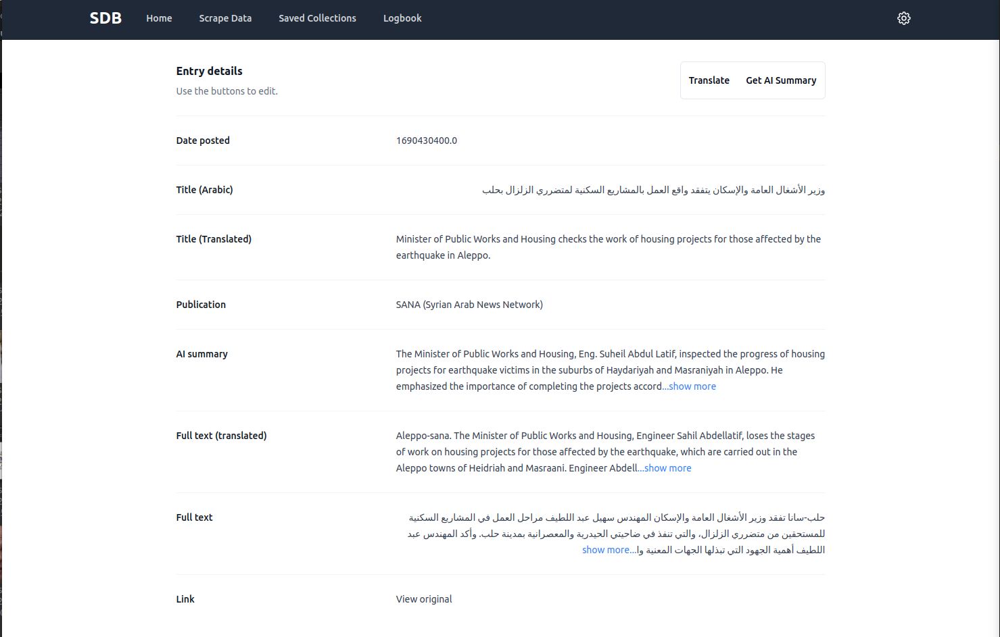
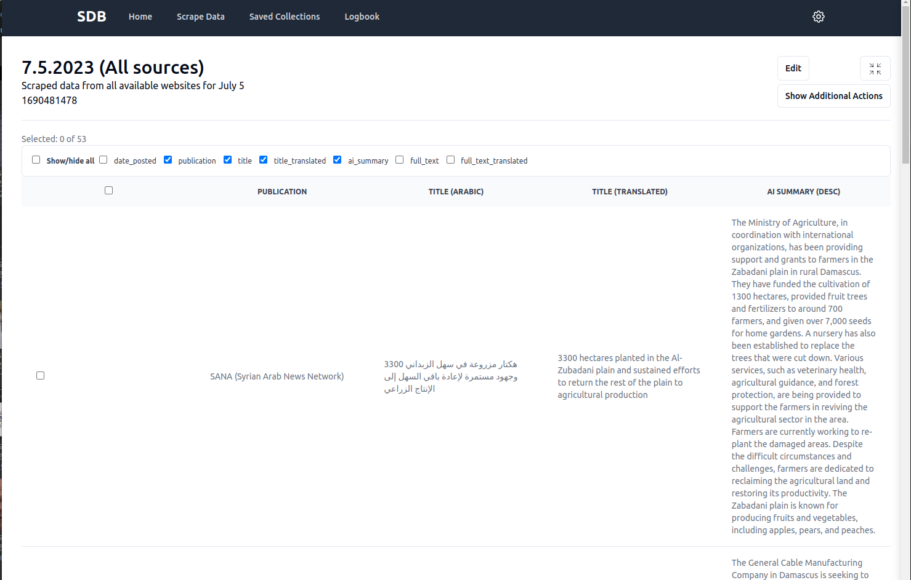

<!-- Improved compatibility of back to top link: See: https://github.com/othneildrew/Best-README-Template/pull/73 -->
<a name="readme-top"></a>
<!--
*** Thanks for checking out the Best-README-Template. If you have a suggestion
*** that would make this better, please fork the repo and create a pull request
*** or simply open an issue with the tag "enhancement".
*** Don't forget to give the project a star!
*** Thanks again! Now go create something AMAZING! :D
-->


<!-- PROJECT SHIELDS -->
<!--
*** I'm using markdown "reference style" links for readability.
*** Reference links are enclosed in brackets [ ] instead of parentheses ( ).
*** See the bottom of this document for the declaration of the reference variables
*** for contributors-url, forks-url, etc. This is an optional, concise syntax you may use.
*** https://www.markdownguide.org/basic-syntax/#reference-style-links
-->
[![Contributors][contributors-shield]][contributors-url]
[![Forks][forks-shield]][forks-url]
[![Stargazers][stars-shield]][stars-url]
[![Issues][issues-shield]][issues-url]
[![MIT License][license-shield]][license-url]
[![LinkedIn][linkedin-shield]][linkedin-url]


<!-- PROJECT LOGO -->
<br />
<div align="center">
    

<h3 align="center">Syria Daily Brief</h3>

  <p align="center">
    An AI-powered web scraper built for Syria analysts and observers.
    <br />
    <a href="https://github.com/jclark1913/syria-daily-brief"><strong>Explore the docs »</strong></a>
    <br />
    <br />
    <!-- <a href="https://github.com/jclark1913/syria-daily-brief">View Demo</a> -->
    ·
    <a href="https://github.com/jclark1913/syria-daily-brief/issues">Report Bug</a>
    ·
    <a href="https://github.com/jclark1913/syria-daily-brief/issues">Request Feature</a>
  </p>
</div>


<!-- TABLE OF CONTENTS -->
<details>
  <summary>Table of Contents</summary>
  <ol>
    <li>
      <a href="#about-the-project">About The Project</a>
      <ul>
        <li><a href="#built-with">Built With</a></li>
      </ul>
    </li>
    <!-- <li>
      <a href="#getting-started">Getting Started</a>
      <ul>
        <li><a href="#prerequisites">Prerequisites</a></li>
        <li><a href="#installation">Installation</a></li>
      </ul>
    </li> -->
    <li><a href="#screenshots">Screenshots</a></li>
    <li><a href="#roadmap">Roadmap</a></li>
    <!-- <li><a href="#contributing">Contributing</a></li>
    <li><a href="#license">License</a></li>
    <li><a href="#contact">Contact</a></li>
    <li><a href="#acknowledgments">Acknowledgments</a></li> -->
  </ol>
</details>


<!-- ABOUT THE PROJECT -->

**_Note (April 2025):_** _This repository is no longer maintained. A lot has happened since I started this project in summer 2023. For starters: the Assad regime totally collapsed in December 2024, upending the former government decades long control over the country's media. The news and media landscape is totally different now - and I think I'd probably approach a media monitoring project like this differently were I to start it today._

_This was also my first "big" project when I was diving deeper into web scraping and Python. I used it as a launching point to experiment with IP rotation, asynchronous functions, Pandas and just about every web scraping framework you can think of. Same with the React frontend - to build my ideal dashboard I messed around with custom hooks, component libraries, and a lot of trial and error to get things where I wanted them to be. I stopped maintaining this project around the time I took on my first professional software work. Looking back on it now I'd have approached the design a bit differently and probably tried to lean into AWS and serverless functions right from the start._

_If you like the direction of this project and would like to revive it or to retool any of the code you find here, please feel free to do so._

## About The Project

Tracking news and press releases is time-consuming, particularly when dealing with press releases and propaganda from the regime and non-state actors. As an analyst and perennial Syria-watcher, I want to build tools that ease this process - to streamline the gathering, translating and curating of data so more time can be spent analyzing trends and sentiments rather than monitoring social media feeds. Enter this project.

Syria Daily Brief is a web scraper designed to gather posts, articles and press announcements from a variety of Arabic-language sources run by governments, non-state actors and independent press. This project is designed to complement the work of Syria-focused analysts, particularly those who deal with large quantities of open-source data.

The project features a backend API written in Flask/Python and a frontend UI build in React/Javascript/TailwindCSS. It also features a PostgreSQL database with SQLAlchemy as an ORM and Marshmallow for json schema validation, as well as numerous other Python libraries such as Beautiful Soup, Pandas, OpenAI, etc to handle various features. While SDB is a standalone API in and of itself, you can view the frontend GUI [here](https://github.com/jclark1913/sdb-frontend).

This project is currently in active development - check back soon for its first stable release.

<p align="right">(<a href="#readme-top">back to top</a>)</p>


### Built With

<div align="center">

![Python][Python]
![React.js][React.js]
![Flask][Flask]
![ChatGPT][ChatGPT]
![Pandas][Pandas]

</div>

Additional libraries/tools: [Marshmallow](https://github.com/marshmallow-code/marshmallow), [SQLAlchemy](https://www.sqlalchemy.org/), [BeautifulSoup4](https://pypi.org/project/beautifulsoup4/)

<p align="right">(<a href="#readme-top">back to top</a>)</p>


<!-- GETTING STARTED -->
<!-- ## Getting Started

This is an example of how you may give instructions on setting up your project locally.
To get a local copy up and running follow these simple example steps.

### Prerequisites

This is an example of how to list things you need to use the software and how to install them.
* npm
  ```sh
  npm install npm@latest -g
  ```

### Installation

1. Get a free API Key at [https://example.com](https://example.com)
2. Clone the repo
   ```sh
   git clone https://github.com/jclark1913/syria-daily-brief.git
   ```
3. Install NPM packages
   ```sh
   npm install
   ```
4. Enter your API in `config.js`
   ```js
   const API_KEY = 'ENTER YOUR API';
   ```

<p align="right">(<a href="#readme-top">back to top</a>)</p> -->


<!-- USAGE EXAMPLES -->
<!-- ## Usage

Use this space to show useful examples of how a project can be used. Additional screenshots, code examples and demos work well in this space. You may also link to more resources.

_For more examples, please refer to the [Documentation](https://example.com)_

<p align="right">(<a href="#readme-top">back to top</a>)</p> -->

<!-- SCREENSHOTS -->

## Screenshots

<div align="center">


</div>


<!-- ROADMAP -->
## Roadmap

- Collect data from a spectrum of Arabic-language websites:
  - [x] Specify timespan for data collection (Last 24 hrs, last week, last 6 months, etc)
  - [x] Gather data from a single source or cast a wide net to all available websites/outlets
  - [ ] Expand data collection to dozens of sources

- Manage collected data:
  - [x] Explore collected data through responsive UI
  - [ ] Search, tag and filter entries
  - [ ] Export data to .csv, .xlsx formats

- Machine translations and summaries:
  - [x] Utilize GPT-3.5/GPT-4 to summarize Arabic datasets
  - [x] Get quick translations via [ArgosTranslate](https://github.com/argosopentech/argos-translate)

- Use responsive UI to view, edit and manage data:
  - [x] Save scraped data to personalized collections
  - [x] View entries in sortable, editable database
  - [ ] Search data and tag entries of interest
  - [ ] Personalize data collection operations from frontend
  - [ ] Deploy project as offline, cross-platform Electron.js app

<!-- See the [open issues](https://github.com/jclark1913/syria-daily-brief/issues) for a full list of proposed features (and known issues). -->

<p align="right">(<a href="#readme-top">back to top</a>)</p>


<!-- CONTRIBUTING -->
<!-- ## Contributing

Contributions are what make the open source community such an amazing place to learn, inspire, and create. Any contributions you make are **greatly appreciated**.

If you have a suggestion that would make this better, please fork the repo and create a pull request. You can also simply open an issue with the tag "enhancement".
Don't forget to give the project a star! Thanks again!

1. Fork the Project
2. Create your Feature Branch (`git checkout -b feature/AmazingFeature`)
3. Commit your Changes (`git commit -m 'Add some AmazingFeature'`)
4. Push to the Branch (`git push origin feature/AmazingFeature`)
5. Open a Pull Request

<p align="right">(<a href="#readme-top">back to top</a>)</p> -->


<!-- LICENSE -->
## License

Distributed under the MIT License. See `LICENSE.txt` for more information.

<p align="right">(<a href="#readme-top">back to top</a>)</p>


<!-- CONTACT -->
## Contact

Justin Clark - [@JustinClarkJO](https://twitter.com/JustinClarkJO) - jclarksummit AT gmail DOT com

Project Link: [https://github.com/jclark1913/syria-daily-brief](https://github.com/jclark1913/syria-daily-brief)

<p align="right">(<a href="#readme-top">back to top</a>)</p>


<!-- ACKNOWLEDGMENTS -->
<!-- ## Acknowledgments

* []()
* []()
* []()

<p align="right">(<a href="#readme-top">back to top</a>)</p> -->


<!-- MARKDOWN LINKS & IMAGES -->
<!-- https://www.markdownguide.org/basic-syntax/#reference-style-links -->
[contributors-shield]: https://img.shields.io/github/contributors/jclark1913/syria-daily-brief.svg?style=for-the-badge
[contributors-url]: https://github.com/jclark1913/syria-daily-brief/graphs/contributors
[forks-shield]: https://img.shields.io/github/forks/jclark1913/syria-daily-brief.svg?style=for-the-badge
[forks-url]: https://github.com/jclark1913/syria-daily-brief/network/members
[stars-shield]: https://img.shields.io/github/stars/jclark1913/syria-daily-brief.svg?style=for-the-badge
[stars-url]: https://github.com/jclark1913/syria-daily-brief/stargazers
[issues-shield]: https://img.shields.io/github/issues/jclark1913/syria-daily-brief.svg?style=for-the-badge
[issues-url]: https://github.com/jclark1913/syria-daily-brief/issues
[license-shield]: https://img.shields.io/github/license/jclark1913/syria-daily-brief.svg?style=for-the-badge
[license-url]: https://github.com/jclark1913/syria-daily-brief/blob/master/LICENSE.txt
[linkedin-shield]: https://img.shields.io/badge/-LinkedIn-black.svg?style=for-the-badge&logo=linkedin&colorB=555
[linkedin-url]: https://linkedin.com/in/justin-w-clark
[product-screenshot]: docs/images/saved_collections.png
[product-screenshot2]: docs/images/entries_list.png
[product-screenshot3]: docs/images/entry_detail.png
[React]: https://img.shields.io/badge/React-61DAFB?logo=react&logoColor=white
[React.js]: https://img.shields.io/badge/React-20232A?style=for-the-badge&logo=react&logoColor=61DAFB
[React-url]: https://reactjs.org/
[Bootstrap.com]: https://img.shields.io/badge/Bootstrap-563D7C?style=for-the-badge&logo=bootstrap&logoColor=white
[Bootstrap-url]: https://getbootstrap.com
[PostgreSQL]: https://img.shields.io/badge/PostgreSQL-4169E1?logo=postgresql&logoColor=white
[ElephantSQL]: https://img.shields.io/badge/ElephantSQL-2D9CDB?logo=elephantsql&logoColor=white
[Render]: https://img.shields.io/badge/Render-000000?logo=render&logoColor=white
[Express]: https://img.shields.io/badge/Express-000000?logo=express&logoColor=white
[Node.js]: https://img.shields.io/badge/Node.js-339933?logo=node.js&logoColor=white
[React Router]: https://img.shields.io/badge/React_Router-CA4245?logo=react-router&logoColor=white
[Vercel]: https://img.shields.io/badge/vercel-%23000000.svg?&logo=vercel&logoColor=white
[TypeScript]: https://img.shields.io/badge/typescript-%23007ACC.svg?&logo=typescript&logoColor=white
[Prisma]: https://img.shields.io/badge/Prisma-3982CE?&logo=Prisma&logoColor=white
[ChatGPT]: https://img.shields.io/badge/chatGPT-74aa9c?style=for-the-badge&logo=openai&logoColor=white
[Python]: https://img.shields.io/badge/Python-3776AB?style=for-the-badge&logo=python&logoColor=white
[Flask]: https://img.shields.io/badge/flask-%23000.svg?style=for-the-badge&logo=flask&logoColor=white
[Pandas]: https://img.shields.io/badge/pandas-%23150458.svg?style=for-the-badge&logo=pandas&logoColor=white
[SQLAlchemy]: https://img.shields.io/badge/SQLAlchemy-8A2BE2
